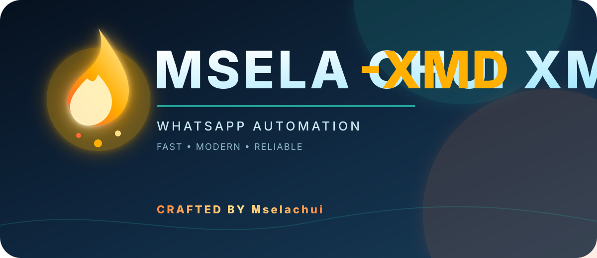

  
   
  
  <h1>MSELA CHUI XMD-XMD</h1>
  
<strong>MSELA CHUI XMD</strong> <em>repository</em>

  

    
    
  

## About MSELA CHUI XMD

𝐌𝐒𝐄𝐋𝐀-𝐂𝐇𝐔𝐈-𝐗𝐌𝐃 is a modular WhatsApp automation project with command plugins, group utilities, media tools, search features, and configurable bot behavior. The project is organized so new commands can be added without disturbing the existing command registry.

> **Project identity:** 𝐌𝐒𝐄𝐋𝐀-𝐂𝐇𝐔𝐈-𝐗𝐌𝐃 is the bot name. The source repository is **𝐌𝐒𝐄𝐋𝐀-𝐂𝐇𝐔𝐈-𝐗𝐌𝐃**.

  
  

  

  <strong>1. FORK REPOSITORY</strong>
   
  

  <strong>2. GET SESSION ID</strong>
   
  

  <strong>3. DEPLOY TO HEROKU</strong>
   
  

  <strong>4. DOWNLOAD BOT ZIP</strong>
   
  

